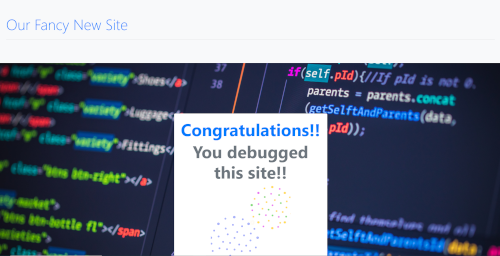
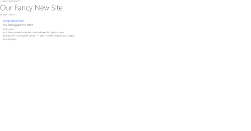

# 🐛 Debugging Activity 

## Activity

Looking for typos and errors is a big part of programming.
In this activity you have two files, one has a working HTML file titled website.html, and another file has the same code - only this file has typos and
errors that need to be corrected.
Compare the files side-by-side and correct the errors.
 
------
 
## Expected Behavior
 
* Open the website.html file in the browser to see how it's suppose to look like.
 
* When you open the site in the browser you should see a polished website. It should look like the following image:
 

 
 
 
-----
 
## Actual Behavior
 
* Open the problem-site.html file in the browser to see what it looks like. 
 
* When you open this site in the browser you will see a much less polished website. It looks like the following image:

